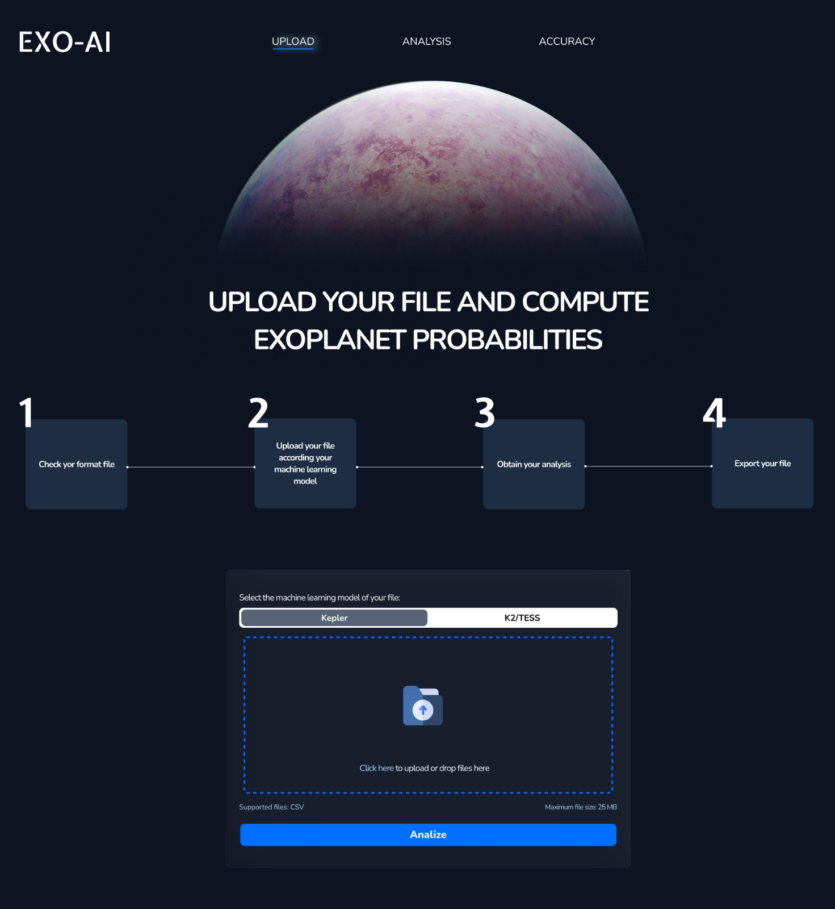
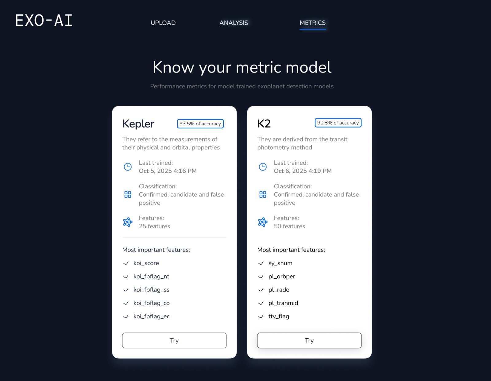

# ExoAI PROJECT

**Project:** ExoAI: AI Exoplanet Classification  
**Team:** Marc Nebot, Miquel Cortijo, Sheyla Castro, Víctor-Xavier Bigorra, Daniel Muñoz 

## Summary
In this project, we aim to bring accessibility to the experience of participating in the discovery of new exoplanets with a user friendly interface, designed for an easy understanding of the data management in this field.
This is the backend service for **ExoAI**, an AI-powered system designed to automatically classify exoplanets using open-source NASA datasets (Kepler, K2, TESS).  
The backend is built with **FastAPI** and serves endpoints for inference and model management.

# ExoAI Frontend

## UI Preview

Below are the main UI screens for **ExoAI**, showcasing the user flow from the main page to analysis and results.

<p align="center">
  
</p>

<p align="center">
  
</p>

<p align="center">
  
</p>

The project structure includes:
- UI/UX ink to Figma: https://www.figma.com/design/5MRJwiYg5YPMPGwdCkFyo5/NASA?node-id=0-1&p=f
- `/backend` → FastAPI app (this folder)
- `/frontend` → Next.js web interface (built separately)

---

## Tech Stack
- **NextJS** develop
- **Figma** UI/UX

---

## Navigation

### Exoplanet AI Backend – Input Feature Reference

#### K2 Model Required Columns

| Column | Description |
|--------|---------|
| pl_name | Exoplanet candidate identifier |
| sy_snum | Number of stars in the system |
| pl_orbper | Orbital period (days) |
| pl_rade | Planet radius (Earth radii) |
| pl_tranmid | Mid-transit time |
| ttv_flag | Transit Timing Variations flag |
| pl_trandep | Transit depth |
| pl_trandur | Transit duration |
| st_teff | Stellar effective temperature (K) |
| st_rad | Stellar radius (solar radii) |
| st_mass | Stellar mass (solar masses) |
| ra | Right Ascension |
| dec | Declination |
| sy_pmra | Proper motion in RA |
| sy_pmdec | Proper motion in Dec |
| sy_dist | Distance to system (pc) |
| sy_plx | Parallax (mas) |
| sy_bmag | B-band magnitude |
| sy_kmag | K-band magnitude |
| sy_umag | U-band magnitude |
| sy_w1mag | WISE W1 magnitude |
| sy_w2mag | WISE W2 magnitude |
| sy_w3mag | WISE W3 magnitude |
| sy_w4mag | WISE W4 magnitude |
| sy_gaiamag | Gaia magnitude |
| sy_kepmag | Kepler magnitude |

#### Kepler Model Required Columns

| Parameter | Description |
|-----------|-------------|
| kepid | Kepler ID: unique identifier for each target star |
| koi_score | Kepler Object of Interest (KOI) score (vetting score) |
| koi_fpflag_nt | Not Transit-like false positive flag (1 = true positive, 0 = false positive) |
| koi_fpflag_ss | Stellar eclipsing binary false positive flag |
| koi_fpflag_co | Contaminated false positive flag |
| koi_fpflag_ec | Eclipsing binary false positive flag |
| koi_period | Orbital period of the candidate planet (days) |
| koi_period_err1 | Positive error on the orbital period |
| koi_period_err2 | Negative error on the orbital period |
| koi_time0bk | Transit epoch (BKJD, Barycentric Kepler Julian Date) |
| koi_time0bk_err1 | Positive error on transit epoch |
| koi_time0bk_err2 | Negative error on transit epoch |
| koi_eccen | Orbital eccentricity |
| koi_impact | Transit impact parameter |
| koi_impact_err1 | Positive error on impact parameter |
| koi_impact_err2 | Negative error on impact parameter |
| koi_duration | Transit duration (hours) |
| koi_duration_err1 | Positive error on duration |
| koi_duration_err2 | Negative error on duration |
| koi_depth | Transit depth (ppm) |
| koi_depth_err1 | Positive error on depth |
| koi_depth_err2 | Negative error on depth |
| koi_prad | Planet radius (Earth radii) |
| koi_prad_err1 | Positive error on planet radius |
| koi_prad_err2 | Negative error on planet radius |
| koi_teq | Equilibrium temperature of the planet (K) |
| koi_insol | Insolation flux received by the planet (Earth flux units) |
| koi_insol_err1 | Positive error on insolation |
| koi_insol_err2 | Negative error on insolation |
| koi_max_sngle_ev | Maximum single event statistic (MES) |
| koi_max_mult_ev | Maximum multiple event statistic (MES) |
| koi_model_snr | Model signal-to-noise ratio |
| koi_count | Number of transits observed |
| koi_num_transits | Number of observed transits |
| koi_tce_plnt_num | Planet number in Threshold Crossing Event (TCE) |
| koi_steff | Stellar effective temperature (K) |
| koi_steff_err1 | Positive error on stellar effective temperature |
| koi_steff_err2 | Negative error on stellar effective temperature |
| koi_smet | Stellar metallicity [Fe/H] |
| koi_smet_err1 | Positive error on stellar metallicity |
| koi_smet_err2 | Negative error on stellar metallicity |
| koi_srad | Stellar radius (solar radii) |
| koi_srad_err1 | Positive error on stellar radius |
| koi_srad_err2 | Negative error on stellar radius |
| koi_smass | Stellar mass (solar masses) |
| koi_smass_err1 | Positive error on stellar mass |
| koi_smass_err2 | Negative error on stellar mass |
| ra | Right Ascension (degrees) |
| dec | Declination (degrees) |
| koi_kepmag | Kepler magnitude |
| koi_kmag | K-band magnitude |


---

# ExoAI Backend

## API Documentation

### `/exoplanet/predict`

**Method:** `POST`  
**Description:** Predicts whether each entry in an uploaded dataset is an exoplanet or not.

### Request Parameters
- **model** (`string`, required, query parameter): either `"kepler"` or `"k2"`  
- **file** (`UploadFile .csv`, required, form-data): CSV file containing the input data for prediction

### CSV Requirements
- Must include all required feature columns for the selected model (excluding the target column)  
- Must not contain any missing (`NaN`) values

### Successful Response Example
```json
[
  { "id": "K00075.01", "prediction": "CONFIRMED" },
  { "id": "K00123.04", "prediction": "FALSE POSITIVE" }
]
```

### Error Response Example (Validation Failed)
```json
{
  "detail": "Missing required columns: radius, mass"
}
```

---

## `/exoplanet/ingest`

**Method:** `POST`  
**Description:** Validates a dataset and optionally retrains the selected machine learning model.

### Request Parameters
- **model** (`string`, required, query parameter): `"kepler"` or `"k2"`  
- **file** (`UploadFile .csv`, required, form-data): New dataset to validate or retrain

### Behavior
- Validates CSV columns and data types  
- If valid, retrains the selected model using internal training dataset (`K2_dataset.csv` or `Kepler_dataset.csv`)  
- Saves the updated `.pkl` model and scaler

### Success Response Example
```json
{
  "status": "success",
  "model": "k2"
}
```

### Failure Response Example
```json
{
  "status": "failed"
}
```
For more information, enter: http://localhost:8000/docs 

## Tech Stack

- **FastAPI** for the web server  
- **Uvicorn** as ASGI server  
- **scikit-learn** for ML model training and inference  
- **Joblib** for model persistence  
- **NumPy** and **Pandas** for data processing  

---

## Project Structure

```
├── backend                                 # FastAPI backend, handles model training, prediction, and metrics
│ ├── app
│ │ ├── init.py
│ │ ├── main.py
│ │ ├── data
│ │ │ └── data.py
│ │ ├── models
│ │ │ ├── init.py
│ │ │ ├── model_handler.py
│ │ │ ├── k2_model
│ │ │ │ ├── K2_dataset.csv
│ │ │ │ ├── k2_scaler.pkl
│ │ │ │ ├── k2_stacking_classifier.pkl
│ │ │ │ ├── K2_train_data.csv
│ │ │ │ ├── train_k2_model.ipynb
│ │ │ │ └── train_k2_model.py
│ │ │ └── kepler_model
│ │ │ ├── Kepler_dataset.csv
│ │ │ ├── kepler_scaler.pkl
│ │ │ ├── kepler_stacking_classifier.pkl
│ │ │ ├── Kepler_train_data.csv
│ │ │ ├── train_kepler_model.ipynb
│ │ │ └── train_kepler_model.py
│ │ ├── routes
│ │ │ ├── init.py
│ │ │ └── exoplanet.py
│ │ └── schemas
│ │ ├── init.py
│ │ └── exoplanet.py
│ └── pycache/
├── tests                                      # Test datasets and unit tests for backend endpoints
│ ├── planet_target.csv
│ ├── planet.csv
│ ├── test_k2_model.csv
│ ├── test_kepler_model.csv
│ └── test_predict.py
├── frontend                                   # React/Next.js frontend for user interface and interaction
│ ├── app
│ │ ├── analysis
│ │ │ ├── loading.tsx
│ │ │ └── page.tsx
│ │ ├── globals.css
│ │ ├── layout.tsx
│ │ └── page.tsx
│ ├── components
│ │ └── ui
│ │ └── theme-provider.tsx
│ ├── hooks
│ │ ├── use-mobile.ts
│ │ └── use-toast.ts
│ ├── lib
│ │ └── utils.ts
│ ├── public
│ │ ├── placeholder-logo.png
│ │ ├── placeholder-logo.svg
│ │ ├── placeholder-user.jpg
│ │ ├── placeholder.jpg
│ │ ├── placeholder.svg
│ │ └── planet.jpg
│ └── styles
│ └── globals.css
├── UIUX                                      # Screenshots and design mockups of the interface
│ ├── analytics_page.jpeg
│ ├── main_page.jpeg
│ └── metrics_page.jpeg
├── .gitignore                                # Git ignore rules
├── README.md                                 # Project documentation
└── requirements.txt                          # Python dependencies for backend
├── frontend/.gitignore
├── frontend/components.json
├── frontend/next.config.mjs
├── frontend/package-lock.json
├── frontend/package.json
├── frontend/pnpm-lock.yaml
├── frontend/postcss.config.mjs
└── frontend/tsconfig.json
```


---

## Data
- The functions in this program filter the data recieved from the csv archives so it is ready to be used by the model and begin the process.


---

## Model Training Workflow

1. **Data Preprocessing**
   - Load CSV files into pandas DataFrames.
   - Separate target (`target`) from features.
   - Drop unnecessary columns (e.g., `pl_name`, IDs).
   - Split into training and test sets (`train_test_split`) with stratification.
   - Scale features using `StandardScaler`.

2. **Base Classifiers**
   - Random Forest (`RandomForestClassifier`)  
   - XGBoost (`XGBClassifier`)  

3. **Stacking Ensemble**
   - Combine the base classifiers using `StackingClassifier`.
   - Logistic Regression is used as the final estimator.
   - Train on the scaled training data.

4. **Evaluation**
   - Predictions are made on the test set.
   - All metrics including classification reports, confusion matrices, and accuracies are documented in the training notebooks:
     - `train_k2_model.ipynb`
     - `train_kepler_model.ipynb`

5. **Model Saving**
   - Models and scalers are saved as `.pkl` files for later use:
     - `k2_stacking_classifier.pkl` / `k2_scaler.pkl`
     - `kepler_stacking_classifier.pkl` / `kepler_scaler.pkl`
   - Feature names and model accuracy are stored internally within the saved models.

---

## Run Locally

### 1 Create virtual environment
```bash
python -m venv venv
source venv/bin/activate
```

### 2 Install dependencies
```bash
pip install -r requirements.txt
```

### 3 Start backend
```bash
uvicorn app.main:app --reload --host 0.0.0.0 --port 8000
```

### 4 Start frontend
```bash
npm install
npm run dev
```
---

## Notes
- The backend is fully compatible with **Next.js** frontend (via CORS).  
- Make sure `models/k2_model/k2_stacking_classifier.pkl` & `models/kepler_model/kepler_stacking_classifier.pkl` exist before starting the server.  
- You can replace or retrain the model easily by updating the `.pkl` file.

---

**ExoAI Backend** — built during a 48h Hackathon  
“Exploring the universe, one exoplanet at a time.”

# Data methodology and physical reasoning

The process to build an efficient method to compute exoplanets probabilities from specific data sets followed the next steps.

## Selecting and filtering the data

We took NASA data and resources provided by the project in:
[A World Away: Hunting for Exoplanets with AI](https://www.spaceappschallenge.org/2025/challenges/a-world-away-hunting-for-exoplanets-with-ai/?tab=resources)

In particular, the Kepler Objects of Interest, the TESS Objects of Interest and the K2 Planets and Candidates.
Research articles therein were also read, mainly [Exoplanet Detection Using Machine Learning](https://academic.oup.com/mnras/article/513/4/5505/6472249?login=false) but discarded due to its use of light curves, although tis paper as well as the one in [Assessment of Ensemble-Based Machine Learning Algorithms for Exoplanet Identification](https://www.mdpi.com/2079-9292/13/19/3950) expressed the intention of using Kepler, K2 and TESS data sets.
The three data sets considered were then treated the following way.

### Kepler Objects of Interest (KOI)

The main focus on this data set were the variables related to the transit, such as transit epoch, duration and depth, number of transits, false positives and signal to noise data. The values of the Kepler and K-band were also considered as band reference magnitudes.
Also, some parameters such as orbital period, eccentricity, impact parameter, equilibrium temperature and insolation flux were intended to be considered in order to account for a flux spectrum analysis.
Multiple and single event statistics, as well as number of planets, were considered to account for multiplicity of transits.
Parameters such as RA and Dec, stellar Mass, Metallicity, Effective Temperature and Radius and planetary radius were considered to provide a complete image.
Finally, Exoplanet Archive Disposition and Disposition Using Kepler Data were considered as control variable and reference target for the probabilities provided by our model, and the Disposition Score as a measure of the reliability of each disposition.

### TESS Objects of Interest (TOI)

Almost all the info in this data set was extracted, but it was later discarded due to:
- The lack of an Archive Disposition variable as a target value which helped to classify each planet as a Confirmed or False Positive candidate to exoplanet, in contrast with the other data sets from Kepler and K2
- The non-zero intersection between planets in this data set and the ones in K2, checked in different ways such as using the program in match.py, which compared the TIC id from both data sets to find matches between them.
It was deduced that many of the objects considered in TESS were already in contained in K2, which also classified in the Exoplanet Archive via a cathegory of Exoplanet Archive Dispositio, so this data set was rejected.

### K2 Planets and Candidates

The main point of interest of this data set was the wide range of broad band magnitudes shown. In particular, Kepler and Gaia Magnitude were initially considered as widely known and common reference in their respective band, the I (Cousins) Magnited as a reference in the infrared band, the u (Sloan) MAgnitude as a reference in the ultraviolet infrared, the Ks (2MASS) and B (Johnson) bands to complete the near infrarred and ultraviolet bands respectively and the W1, W2, W3 and W4 (WISE) magnitudes to account for the inner bands.
The other main point of interest was all that data referred to the transit, spetially transit depth and transit duration. In this sense, also planets discovered by other methods were discarded.
Initially, parameters such as impact parameter, parallax, distance, eccentricity, semimajor axis and orbital period, as well as radial velocity, insolation flux and Spectrum Type were intended to be considered in order to account for a flux spectrum analysis.
RA, Dec, its respective proper motion as well as parameters such as the star Mass, Metallicity, Radius and Effective temperature, the planet Mass and Radius and the number of stars and planets were considered to provide a complete image.
Finally, the Archive Disposition parameter was taken as a control variable to check the probabilities in our training model.

## Treating empty slots

After discarding the TESS data and considering to use the Dispositio parameter as a reference target for our model, we had to treat the empty slots of our data. Initially, the Kepler data was composed of 9565 while the K2 data had 3979.

### K2 empty slots

In this case, many of the parameters chosen had an emptiness rate of more than 50%. Due to its importance, we decided to set the bar of parameters in the percentile corresponding to the u magnitude whych had an emptiness of 54.8%, and drop all the error parameters. The next most empty slot was the one corresponding to the star metallicity, which was decided to be rejected due to be considered as a discarding parameter rather than a confirming one, and the population of refused planets was small. We then decided to drop all the planets with no u magnitude and delete columns of data with a larger emptiness. The rest of the empty slots were filled via KNN imput, providing a data set of 1799 cases.

### Kepler empty slots

In this case, only four parameters had all slots empty and were removed, while the cases within the next parameters with more empty slots, such as the score and the number of transits, were deleted, providing a data set of 7796 cases.

## Correlation of the first training

During the first model trainings, some already known correlation between parameters were shown, such as almost complete correlation between different magnitude band references, among them the W1-W2-W3-W4, Kepler-Gaia and B-Ks correlations.

## Random Forest importances

During the first Random Forest model training an statistic of the most important features for both models was obtained, which showed a relation of relative importance of various parameters for each data set.

### K2 Random Forest

The number of planets accounted for more than 50% of the importance in this test. It was decided that the ammount of planets had a direct relation in considering if the case studied is a confirmed or a false positive: the more planets, the more likely is the case to be a confirmed exoplanet. So by a similar but reversed argument than that for the star metallicity, the number of planets was dropped. The default parameter flag was also rejected.
Moreover, it was observed that all the magnitude related parameters and transit related parameters had a similar relative importance as we expected, which reinforced the idea to reject the more hoarder parameters of planet number and parameter flag in favor of a more distributed relative importance between this magnitude and transit parameters and the rest.

### Kepler Random Forest

In this case, the Kepler Disposition was accounting for  more than 50% of the relative importance, so it was decided to be rejected due to the fact of being considered an a priori classification of each case which should not affect the main classification of the Exoplanet Archive Disposition.